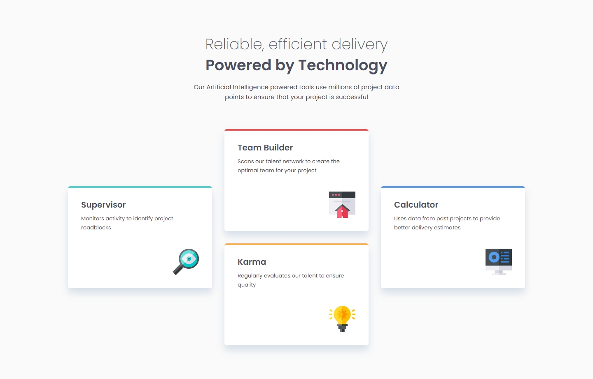
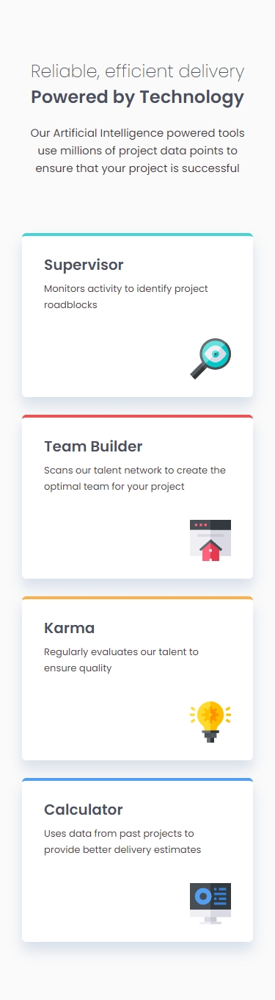

## Frontend Mentor Challenge 07 - Four Card Feature Section

This is my solution to the [Four Card Feature Section challenge on FrontendMentor.io](https://www.frontendmentor.io/challenges/four-card-feature-section-weK1eFYK).

### Screenshots of My Solution (Desktop & Mobile) 👻

#

### Links 🔗

- Live Site URL: [URL]
- Solution URL: [URL]

#

### Features 🎉

- Mobile Responsive 📱
- Self-hosted Fonts for Better Performance 🔡
- PWA (Progressive Web App) 📱

#

### Built with 🔧🔨

- React ❄️
- Grid & Flex Layouts 🔲
- Mobile First Approach 📱
- BEM Naming Convention 📚

#

### New Things I Learned 🎓📖

- How to add PWA support to a webpage.
- Self hosting fonts.

#

### Tools I Used 🔧

- [PerfectPixel by WellDoneCode](https://chromewebstore.google.com/detail/perfectpixel-by-welldonec/dkaagdgjmgdmbnecmcefdhjekcoceebi) - A chrome extension that enables you to overlay an image over your HTML webpage. This makes it easy to compare your HTML result with the reference image and adjust fine details.

- [Responsively.app](https://responsively.app/) - A free and open source tool that allows you to test your webpage on different screen sizes, take screenshots and much more.

- [Web ToolBox - Image Comparison Slider](https://web-toolbox.dev/en/tools/image-compare-slider) - Allows you to compare two images using a slider.

- [Prettier VS Code Extension](https://marketplace.visualstudio.com/items?itemName=esbenp.prettier-vscode) - Code formatter.

- [pwa-asset-generator](https://github.com/elegantapp/pwa-asset-generator) - Generates favicons, icon and splash screen images. Updates manifest.json and index.html files with the generated images according to Web App Manifest specs and Apple Human Interface guidelines.

- [webfont-generator](https://www.fontsquirrel.com/tools/webfont-generator) - Convert your TTF fonts to WOFF and WOFF2 formats.

#

- My Frontend Mentor Profile - [@DarkstarXDD](https://www.frontendmentor.io/profile/DarkstarXDD)
